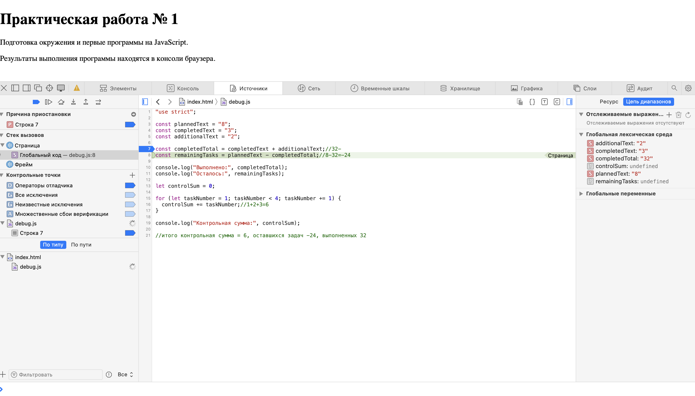

# Практическая работа № 1. Подготовка окружения и первые программы на JavaScript

## Автор и вариант

- Студент: Юрченко Георгий
- Группа: ЭФБО-04-25
- Номер в журнале: 33
- Вариант: 1 (`((33 - 1) % 8) + 1 = 1`)

## Окружение

| Инструмент | Версия |
| --- | --- |
| ОС | macOS |
| Node.js | v24.21.0 |
| npm | 11.19.0 |
| Git | 2.39.5 |
| Браузер | Safari |

## Запуск

Все команды выполняются из корня репозитория `tip-js-practices`:

```
node practice-01/js/hello.js
node practice-01/js/types.js
node practice-01/js/progress.js
node practice-01/js/plan.js
node practice-01/js/debug.js
```

В браузере: открыть `practice-01/index.html`, в теге `script` указать путь к нужному файлу, сохранить, перезагрузить страницу и открыть консоль разработчика (Safari: `Cmd + Option + C`).

## Задание 1. Один файл — две среды выполнения

**Node.js** — команда `node practice-01/js/hello.js`, вывод в терминале:

```
Студент: Юрченко Георгий
Группа: ЭФБО-04-25
Практическая работа: 1
JavaScript успешно запущен
Тип document: undefined
```

**Safari** — `index.html`, вывод в консоли разработчика (не на странице):

```
[Log] Студент: Юрченко Георгий (hello.js, line 7)
[Log] Группа: ЭФБО-04-25 (hello.js, line 8)
[Log] Практическая работа: 1 (hello.js, line 9)
[Log] JavaScript успешно запущен (hello.js, line 10)
[Log] Тип document: – "object" (hello.js, line 11)
```

`[Log]` и `(hello.js, line N)` — служебные пометки консоли Safari, а не вывод программы.

**Различие:** в браузере `typeof document` возвращает `"object"`, потому что скрипт подключён к HTML-странице и браузер предоставляет объект `document` для работы с ней. Node.js запускает файл без страницы и без DOM, поэтому `document` там не существует — `undefined`. Язык JavaScript в обоих случаях одинаковый, различается среда выполнения.

## Задание 2. Типы и преобразования

| № | Выражение | Ожидание до запуска | Фактическое значение | Тип результата | Объяснение |
| --- | --- | --- | --- | --- | --- |
| 1 | `"8" + 2` | `"82"` | `"82"` | string | Если одна сторона строка, `+` превращает число в строку и склеивает (конкатенация). |
| 2 | `"8" - 2` | `6` | `6` | number | У строк нет вычитания, поэтому `-` переводит строку в число и вычитает. |
| 3 | `Number("8") + 2` | `10` | `10` | number | `Number` заранее перевёл строку в число, дальше обычное сложение. |
| 4 | `"12" > "3"` | `false` | `false` | boolean | Сравниваются строки посимвольно слева направо: `"1"` меньше `"3"`, поэтому `"12"` не больше `"3"`. |
| 5 | `12 === "12"` | `false` (сначала думал `true`) | `false` | boolean | `===` проверяет и значение, и тип; типы разные (number и string), преобразования нет. |
| 6 | `Number("")` | не знаю: `0` или `NaN` | `0` | number | После обрезки пробелов не осталось символов, пустоту `Number` превращает в `0`. |
| 7 | `Number("text")` | ошибка | `NaN` | number | Непреобразуемый текст даёт `NaN` («не число»), программа не падает. |
| 8 | `Boolean("false")` | `false` | `true` | boolean | В списке ложных значений только пустая строка; `"false"` непустая, смысл слова не учитывается. |
| 9 | `typeof null` | `NaN` | `"object"` | string | `"object"` — историческая ошибка языка; тип `string`, потому что `typeof` возвращает название типа строкой. |
| 10 | `typeof NaN` | `number` | `"number"` | string | `NaN` относится к числам; `typeof` вернул название типа в виде строки. |

Файл запущен в Node.js и Safari, результаты совпадают.

## Задание 3. Сводка выполнения задач

Файл: `practice-01/js/progress.js`

### Логика решения

Сначала выполняются проверки входных данных, и только потом расчёт. Так при некорректных данных или при нуле задач не происходит деления на ноль. Проверки идут в таком порядке:

1. Оба значения имеют тип `number` — отсекаются строки.
2. Оба значения конечные числа (`Number.isFinite`) — отсекается `NaN`. Эта проверка стоит отдельно, потому что `typeof NaN` возвращает `"number"`.
3. Оба значения целые (`Number.isInteger`) — отсекаются дроби.
4. Значения не отрицательные.
5. `totalTasks` не больше 1000.
6. `completedTasks` не больше `totalTasks`.
7. Если `totalTasks === 0` — выводится «Задач пока нет». После проверки 6 это возможно только при `0` и `0`.
8. Иначе рассчитываются остаток, процент (`toFixed(1)`) и статус. Статус определяется по исходным количествам, а не по округлённому проценту.

### Результат для своего варианта (вариант 1: 12 и 5)

```
Всего задач: 12
Выполнено: 5
Осталось: 7
Прогресс: 41.7%
Статус: В работе
```

### Проверки

| № | Проверка | `totalTasks` | `completedTasks` | Ожидаемый результат | Фактический результат | Итог |
| --- | --- | --- | --- | --- | --- | --- |
| 1 | Обычный случай (вариант) | `12` | `5` | Осталось 7; 41.7%; «В работе» | Осталось: 7; Прогресс: 41.7%; Статус: В работе | Пройдено |
| 2 | Нет задач | `0` | `0` | «Задач пока нет», без расчёта | Задач пока нет | Пройдено |
| 3 | Граница: ничего не выполнено | `5` | `0` | Осталось 5; 0.0%; «Не начато» | Осталось: 5; Прогресс: 0.0%; Статус: Не начато | Пройдено |
| 4 | Граница: всё выполнено | `5` | `5` | Осталось 0; 100.0%; «Завершено» | Осталось: 0; Прогресс: 100.0%; Статус: Завершено | Пройдено |
| 5 | Выполнено больше общего | `5` | `6` | Ошибка | Ошибка: выполнено больше, чем существует | Пройдено |
| 6 | Отрицательное значение | `-1` | `0` | Ошибка | Ошибка: количество задач не может быть отрицательным | Пройдено |
| 7 | Дробное значение | `5` | `2.5` | Ошибка | Ошибка: количество задач не может быть дробным | Пройдено |
| 8 | Строка вместо числа | `"5"` | `2` | Ошибка | Ошибка: вместо числа передана строка или значение другого типа | Пройдено |
| 9 | Превышена верхняя граница | `1001` | `0` | Ошибка | Ошибка: превышена верхняя граница (не больше 1000 задач) | Пройдено |
| 10 | Недопустимое число | `NaN` | `0` | Ошибка | Ошибка: недопустимое числовое значение | Пройдено |

### Найденная ошибка при выполнении

При первой проверке случая `0` и `0` программа ничего не выводила. Причина: условие `else if (totalTasks === 0)` было записано дважды, и первая ветка была пустой. В цепочке `if / else if` выполняется только первая подходящая ветка, поэтому выполнялась пустая, а до ветки с выводом дело не доходило. Лишняя строка удалена, после этого проверка пройдена.

## Задание 4. План выполнения задач по дням

Файл: `practice-01/js/plan.js`

### Логика решения

1. Проверки `totalTasks` и `completedTasks` выполняются так же, как в задании 3.
2. Проверки `dailyLimit` идут в том же порядке: тип `number` → конечное число → целое → границы `1…1000`. Норма проверяется до цикла, даже если задач не осталось. Нижняя граница `1` защищает от бесконечного цикла: при норме `0` остаток никогда бы не уменьшался.
3. При корректных данных вычисляется остаток `totalTasks - completedTasks`.
4. Цикл `while (remainingTasks > 0)` на каждой итерации увеличивает номер дня, определяет количество задач на день через `Math.min(dailyLimit, remainingTasks)` и уменьшает остаток.
5. `Math.min` гарантирует, что в последний день выполняется не больше задач, чем осталось, и остаток не становится отрицательным.
6. Если остаток равен `0`, цикл не выполняется ни разу, счётчик дней остаётся `0`, отдельная ветка для расчёта не нужна.

### Результат для своего варианта (вариант 1: 12, 5, 3)

```
Осталось задач: 7
День 1: выполнено 3, осталось 4
День 2: выполнено 3, осталось 1
День 3: выполнено 1, осталось 0
Потребуется дней: 3
```

### Проверки

| № | Проверка | `totalTasks` | `completedTasks` | `dailyLimit` | Ожидаемый результат | Фактический результат | Итог |
| --- | --- | --- | --- | --- | --- | --- | --- |
| 1 | Обычный случай (вариант) | `12` | `5` | `3` | 3 дня, в последний день 1 задача | Дни: 3, 3, 1; Потребуется дней: 3 | Пройдено |
| 2 | Остаток делится на норму | `10` | `4` | `3` | 2 дня по 3 задачи | Дни: 3, 3; Потребуется дней: 2 | Пройдено |
| 3 | Норма больше остатка | `5` | `3` | `10` | 1 день, выполнено 2 | День 1: выполнено 2, осталось 0; Потребуется дней: 1 | Пройдено |
| 4 | Всё уже выполнено | `5` | `5` | `2` | 0 дней, цикл не выполняется | Все задачи уже выполнены; Потребуется дней: 0 | Пройдено |
| 5 | Нет задач | `0` | `0` | `2` | 0 дней, цикл не выполняется | Все задачи уже выполнены; Потребуется дней: 0 | Пройдено |
| 6 | Нулевая норма | `5` | `2` | `0` | Ошибка, цикл не запускается | Ошибка: дневная норма должна быть не меньше 1 | Пройдено |
| 7 | Дробная норма | `5` | `2` | `1.5` | Ошибка | Ошибка: дневная норма не может быть дробной | Пройдено |
| 8 | Выполнено больше общего | `5` | `6` | `2` | Ошибка | Ошибка: выполнено больше, чем существует | Пройдено |
| 9 | Норма строкой | `5` | `2` | `"2"` | Ошибка | Ошибка: дневная норма должна быть числом, а не строкой | Пройдено |
| 10 | Превышена граница нормы | `5` | `2` | `1001` | Ошибка | Ошибка: превышена верхняя граница дневной нормы (не больше 1000) | Пройдено |

### Задание 5. Поиск логических ошибок через инструменты разработчика

Файл: `practice-01/js/debug.js`

### Исходный результат (до исправления)

```
Выполнено: 32
Осталось: -24
Контрольная сумма: 6
```

Программа выполнилась без исключений, но результат неверный: ожидалось `5`, `3`, `10`.

### Ход отладки (Safari, Web Inspector → Источники)

1. Поставлена точка останова на строке 7 (вычисление `completedTotal`), страница перезагружена.
2. До выполнения строки в разделе «Глобальная лексическая среда» видно: `completedText: "3"`, `additionalText: "2"` — оба значения строки (тип String).
3. После шага «Перешагнуть» (Step over): `completedTotal: "32"` — строки склеены, результат тоже строка.
4. Строка 8 вычислила `"8" - "32"`: оператор `-` преобразовал строки в числа, получилось `-24`.



### Ошибки и исправления

| Ошибка | Что наблюдалось | Причина | Исправление | Результат после исправления |
| --- | --- | --- | --- | --- |
| Обработка количества задач | `completedTotal` равен `"32"` (строка), `remainingTasks` равен `-24` | Исходные значения — строки; `+` со строками выполняет конкатенацию, а не сложение | Исходные строки явно преобразованы через `Number()` перед вычислением: `Number(completedText) + Number(additionalText)`, `Number(plannedText) - completedTotal` | Выполнено: 5, Осталось: 3 |
| Граница цикла | Контрольная сумма 6 вместо 10 | Условие `taskNumber < 4` завершает цикл при `taskNumber = 4`, число 4 не прибавляется | Условие заменено на `taskNumber <= 4` | Контрольная сумма: 10 |

### Результат после исправления

Node.js (`node practice-01/js/debug.js`) и Safari (консоль) выводят одинаково:

```
Выполнено: 5
Осталось: 3
Контрольная сумма: 10
```

Исходные данные остались строками `"8"`, `"3"`, `"2"`; готовые ответы в код не подставлялись. Точки останова удалены.

## Дополнительное задание. Вариант А: данные поступают строками

Файл: `practice-01/js/progress-input.js`

### Логика решения

Решение задания 3 обёрнуто во входной фильтр:

1. Оба значения имеют тип `string`. Проверка стоит первой: у `null` и `undefined` нет метода `trim()`, и его вызов привёл бы к необработанному исключению.
2. После `trim()` строки не пустые. Отсекаются `""` и строки из пробелов.
3. Очищенные строки преобразуются через `Number()`.
4. Далее проверки задания 3: конечное число (`Number.isFinite` отсекает `NaN` от `"abc"` и значение `Infinity`), целое, не отрицательное, не больше 1000, выполнено не больше общего.
5. Расчёт сводки как в задании 3.

Проверка `typeof ... === "number"` из задания 3 удалена: `Number()` всегда возвращает значение типа `number`, поэтому она никогда бы не сработала.

### Проверки

| № | Проверка | `totalInput` | `completedInput` | Ожидаемый результат | Фактический результат | Итог |
| --- | --- | --- | --- | --- | --- | --- |
| 1 | Обычные строки | `"12"` | `"5"` | Сводка: 7, 41.7%, «В работе» | Осталось: 7; Прогресс: 41.7%; Статус: В работе | Пройдено |
| 2 | Пробелы по краям | `"  12  "` | `" 5"` | Та же сводка | Осталось: 7; Прогресс: 41.7%; Статус: В работе | Пройдено |
| 3 | Пустая строка | `""` | `"5"` | Ошибка | Ошибка: пустой ввод | Пройдено |
| 4 | Строка из пробелов | `"   "` | `"5"` | Ошибка | Ошибка: пустой ввод | Пройдено |
| 5 | Не число | `"abc"` | `"5"` | Ошибка | Ошибка: введено не число или недопустимое значение | Пройдено |
| 6 | Дробное | `"12"` | `"2.5"` | Ошибка | Ошибка: количество задач не может быть дробным | Пройдено |
| 7 | Бесконечность | `"Infinity"` | `"5"` | Ошибка | Ошибка: введено не число или недопустимое значение | Пройдено |
| 8 | `null` | `null` | `"5"` | Ошибка без исключения | Ошибка: значение не передано или не является строкой | Пройдено |
| 9 | `undefined` | `undefined` | `"5"` | Ошибка без исключения | Ошибка: значение не передано или не является строкой | Пройдено |


## Вывод

В работе настроено окружение (Node.js 24 LTS, npm, Git), освоен запуск одного скрипта в Node.js и браузере и различие между языком и средой выполнения. Изучены типы данных и преобразования, условия `if / else if` с проверкой входных данных (тип, `NaN`, целочисленность, границы), цикл `while` и точки останова в инструментах разработчика.

Наиболее показательная ошибка — сложение строк в задании 5: программа не выдала ни одного исключения, но результат оказался неверным (`"32"` вместо `5`). Это показывает, что отсутствие ошибки при запуске не доказывает правильность вычисления, а входные данные нужно явно проверять и преобразовывать. Также при выполнении задания 3 была найдена ошибка с дублирующимся условием `else if`, из-за которого случай `0` и `0` ничего не выводил.
